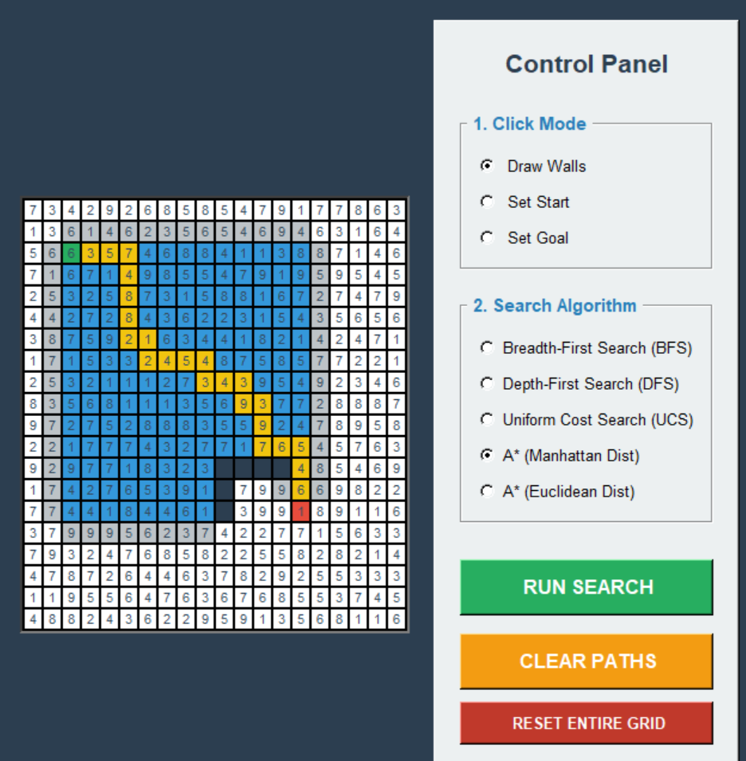
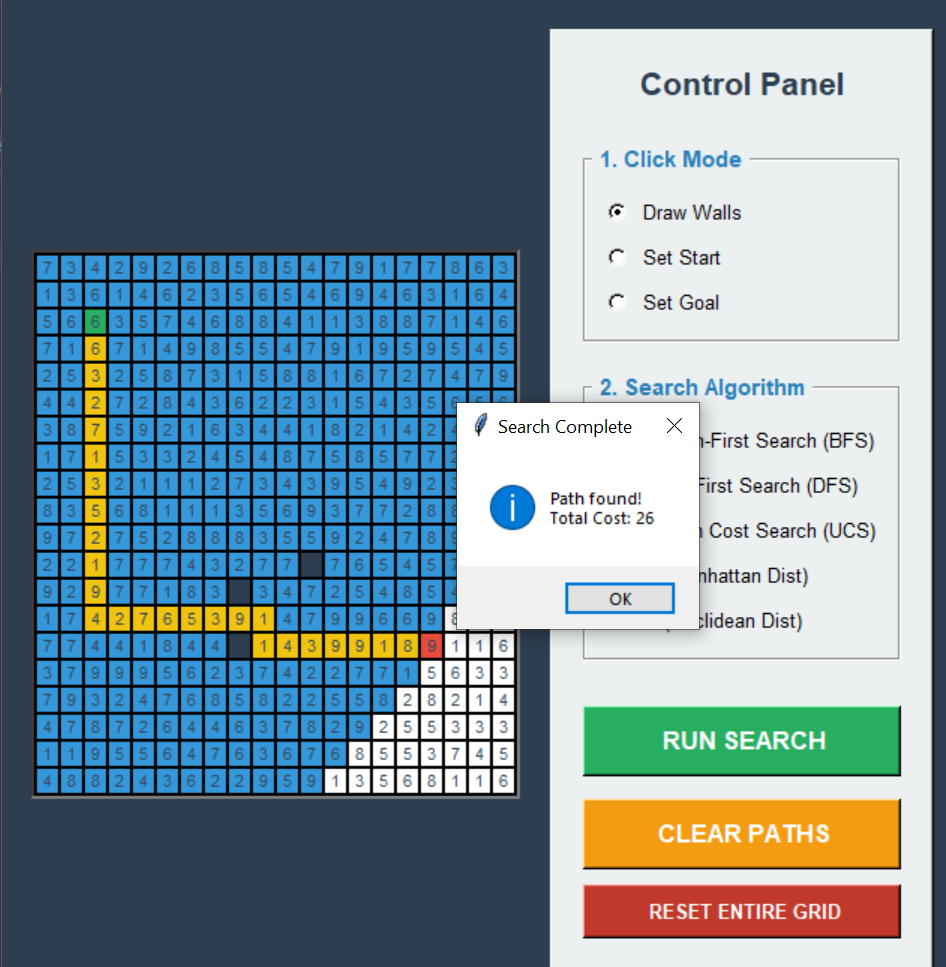
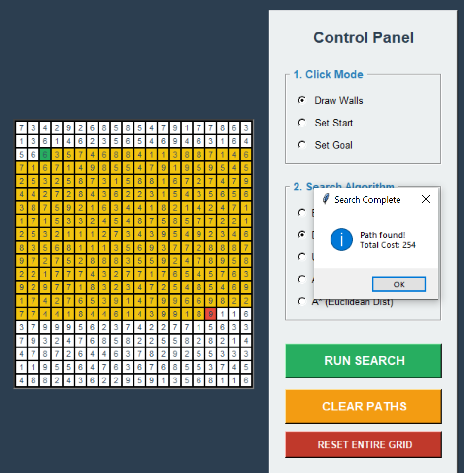
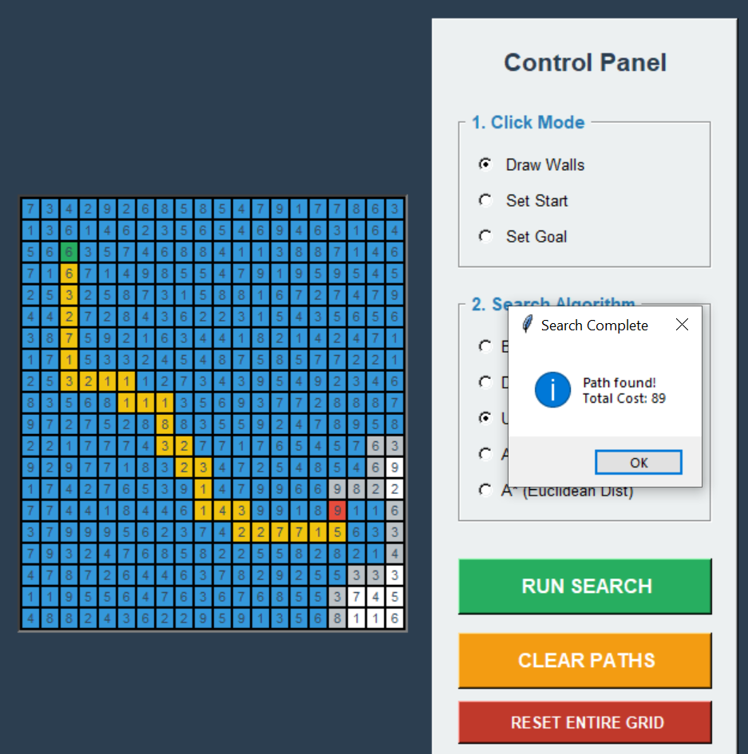
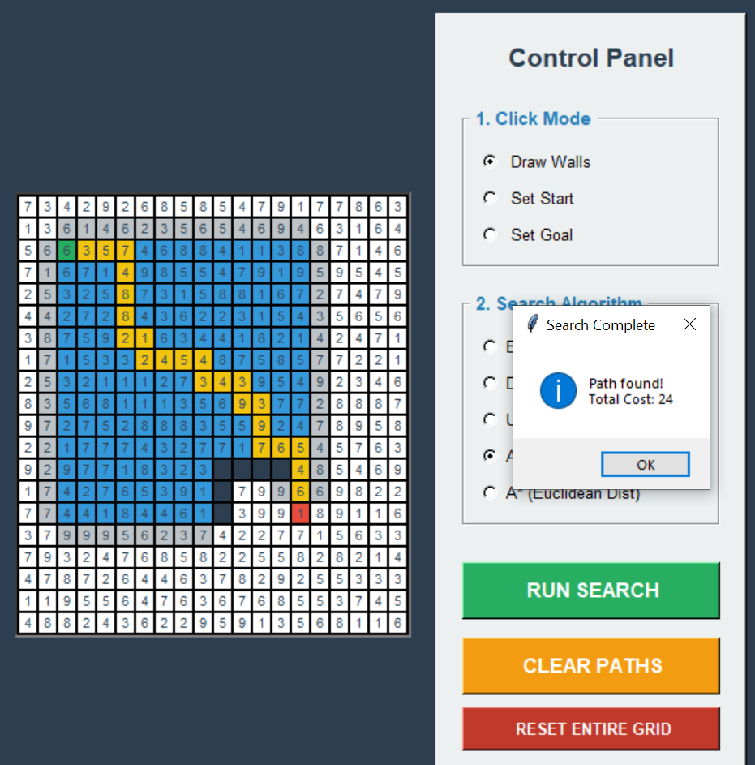
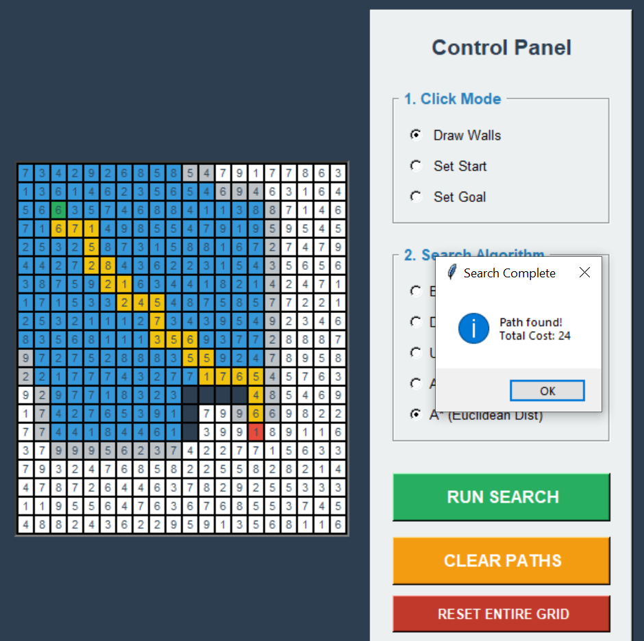

# ai-pathfinding-visualizer

A high-performance, interactive desktop application engineered in Python to visualize how AI search algorithms explore states, manage frontiers, and calculate optimal paths across a 2D grid environment.

This tool models the backend logic of autonomous navigation. It constructs a grid-based state space in memory, applies user-defined constraints (walls/obstacles), and executes uninformed and heuristic-based pathfinding algorithms, rendering the node expansion and optimal route reconstruction in real-time.

## Table of Contents
- [System Overview](#system-overview)
- [Technical Architecture](#technical-architecture)
- [Algorithm Execution & Visuals](#algorithm-execution--visuals)
- [Project Structure](#project-structure)
- [Installation & Execution](#installation--execution)
- [Engineering Team](#engineering-team)

---

## System Overview

The application is driven by a Tkinter graphical interface, allowing for instant environmental manipulation and algorithm testing without complex setup.



### Core Capabilities
* **Interactive Environment Mapping:** Users can dynamically draw un-traversable boundaries (walls), modify the starting agent location, and relocate the target goal directly onto the grid.
* **Real-Time State Traversal Visualization:** The engine visually differentiates between unvisited nodes, active frontier expansion (blue), and the final optimal reconstructed path (yellow).
* **Multi-Algorithm Support:** Features implementations for Breadth-First Search (BFS), Depth-First Search (DFS), Uniform Cost Search (UCS), and A* Search (utilizing both Manhattan and Euclidean heuristics).
* **Dynamic Cost Tracking:** Each grid cell is assigned a random traversal weight (1-9). The interface provides a live readout of the cumulative path cost upon successful goal state discovery.

---

## Technical Architecture

To demonstrate systems-level control over data flow, the core data structures managing the search frontiers were engineered from scratch, bypassing standard high-level Python libraries like `queue` or `heapq`.

### Data Structures & Memory Management
* **Custom Priority Queue (Min-Heap):** UCS and A* algorithms utilize a `CostTrackerArray` class. This is a manually implemented Min-Heap that manages node insertion and dynamic cost updates via custom `bubble_up` and `sink_down` array manipulations, ensuring O(log N) priority retrieval.
* **Uninformed Frontier Management:** BFS and DFS utilize an `UninformedFrontier` class, utilizing fixed-size arrays with manual pointer management (`head`, `tail`, `stack_top`) to simulate rigid Queue and Stack behaviors without dynamic memory reallocation overhead.
* **Space Complexity:** Mapped strictly to the maximum grid dimensions (50x50), capping the state array allocations at 2500 nodes to guarantee zero memory overflow during continuous testing.

### Algorithmic Logic
* **Bounded Expansion:** Node generation strictly forbids diagonal movement, parsing the state space in a 4-directional matrix bounds check.
* **Heuristic Calculations:** 
  * *Manhattan Distance:* Calculates absolute grid-steps, optimized for scenarios with orthogonal constraints.
  * *Euclidean Distance:* Computes the direct vector magnitude to the goal, shifting the A* expansion pattern.

---

## Algorithm Execution & Visuals

The system accurately demonstrates the operational differences between pathfinding paradigms based on their frontier prioritization logic.

### Uninformed Search

**Breadth-First Search (BFS)**
Explores the state space uniformly in concentric layers. Guarantees the shortest path in an unweighted environment.



**Depth-First Search (DFS)**
Aggressively plunges down a single path until reaching a dead-end before backtracking. Highly memory-efficient but non-optimal.



### Informed & Cost-Based Search

**Uniform Cost Search (UCS)**
Expands the frontier based on the lowest cumulative step cost. Unlike BFS, it respects the randomized cell weights to find the mathematically cheapest path, not necessarily the fewest steps.



**A* Search (Manhattan Heuristic)**
Utilizes the sum of cumulative cost and heuristic estimates. The Manhattan heuristic heavily directs the frontier towards the goal, drastically reducing the number of explored nodes compared to UCS while maintaining optimality.



**A* Search (Euclidean Heuristic)**
Applies a straight-line heuristic vector. Displays a slightly different expansion pattern when navigating around complex, angled wall structures.



---

## Project Structure

```text
.
├── assets/
│   ├── astar_e.png
│   ├── astar_m.png
│   ├── bfs.png
│   ├── dfs.png
│   ├── home.png
│   └── ucs.png
├── src/
│   ├── main.py              # Application entry point
│   ├── gui.py               # Tkinter interface and main search loop
│   ├── data_structures.py   # Custom Stack, Queue, and Min-Heap memory
│   └── utils.py             # Heuristics and route reconstruction logic
└── README.md
